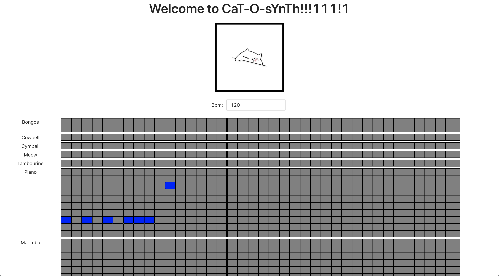

# CaT-O-sYnTh
This is our submission for [Stupid Hack 2021](https://app.hackjunction.com/events/stupid-hack-2021/). Let's you to compose music like an online synthesizer, but the catch tha [bongo.cat](https://bongo.cat/) will play it!1!!!1

[Here](https://youtu.be/yjro3YUspFY) is our video demo.

## Screenshot


## Running

From `core/manip` folder run express server

```sh
node app.js
```

Run frontend application in `bongo-react`:
```sh
npm run start
```

Now you can compose music through this GUI. When `Play` is pressed, it will trigger server to run Chromium with puppeteer script of the song.

## Contributors

- [Anuar Talipov](https://github.com/AnuarTB)
- [Aidyn Aluadin](https://github.com/A-Aidyn)
- [Nurlykhan Kairly](https://github.com/NurlykhanKairly)
- [Abdirakhman Ismail](https://github.com/abdirakhman)